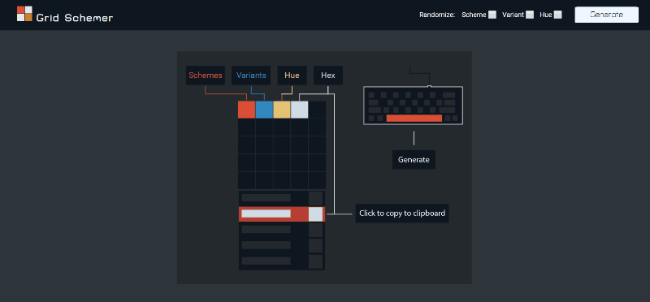

# Grid Schemer

Generate up to 5 color palettes based on 5 color schemes, 6 variations and a hue slider. I wanted to make a palette generator that could create many color schemes simultaneously as well as offer more interesting palettes that one wouldn't typically consider. 

## Usage

Generate grids immediately by pressing the spacebar or clicking the "Generate" button. New schemes can also be generated by clicking on an individual section highlighted when hovered over.

## Built with

color-scheme-js: https://github.com/c0bra/color-scheme-js
